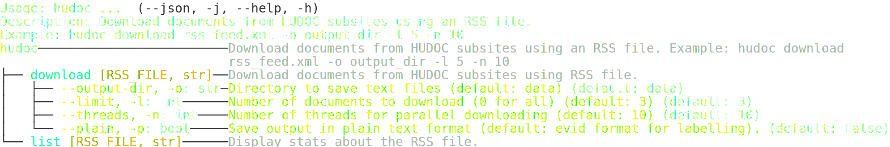

# hudoc

CLI tool for downloading ECHR and GREVIO HUDOC documents

## Installation

Prefer using [uv](https://docs.astral.sh/uv/) for installation:

```sh
uv pip install .
```

## Usage



Example:

```sh
hudoc rss_feed.xml -o output_dir -l 5 -n 10
```

## Documentation

Run `mkdocs serve` to view the documentation locally.
